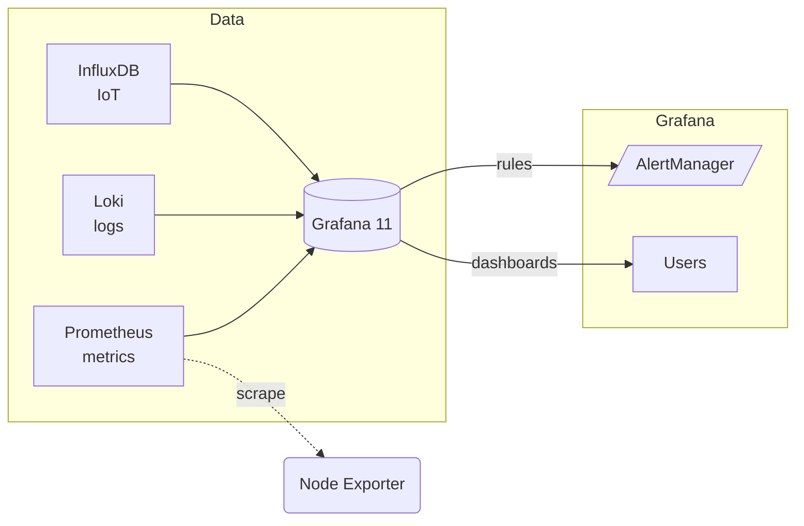

# **Grafana : visualisation et alertes dans un homelab**

  

## **1. Pourquoi Grafana ?**

  

Grafana est devenu la référence open-source pour  **l’observabilité**  : métriques, logs, traces et  _alerting_  unifiés. Dans un homelab d’ingénieur cybersécurité, il sert à :

-   surveiller l’état des hyperviseurs/VM (CPU, RAM, I/O) ;
    
-   détecter les anomalies réseau (pics de trafic, pertes de paquets) ;
    
-   corréler métriques ↔ logs ↔ traces (stack  _Prometheus + Loki + Tempo_) pour accélérer l’analyse d’incident ;
    
-   déclencher des alertes multi-canal (mail, Telegram, webhook) quelques secondes après la dérive.
    

  

Depuis Grafana 11 (mai 2024), le moteur d’alerting unifié est devenu l’unique système : l’ancien « legacy alerting » est retiré du code ; migrer avant Grafana 11 évite toute interruption  .

----------

## **2. Comparatif : Grafana, Kibana, Chronograf**

TABLEAU

**Synthèse :**

_Grafana_  excelle dès qu’on mélange plusieurs back-ends (Prometheus + Loki + InfluxDB) et qu’on veut un seul plan de visualisation + alertes.  _Kibana_  reste le roi pour l’analytics log plein-texte (Elastic / OpenSearch).  _Chronograf_  vit toujours, mais n’évolue plus : bon compagnon Influx v1, moins adapté aux stacks modernes.

----------

## **3. Architecture type « Grafana observability »**



-   **Prometheus**  collecte les métriques (node_exporter, blackbox, SNMP).
    
-   **Loki 3.0**  agrège les logs via  _Promtail_  ; pas d’index plein-texte, coût disque réduit  .
    
-   **Tempo**  (optionnel) capture les traces (OpenTelemetry).
    
-   **Grafana**  lit ces sources, affiche les dashboards et crée les règles d’alertes (contact points, notification policies).
    

----------

## **4. Installation rapide (Docker Compose)**

-   **Prometheus**  collecte les métriques (node_exporter, blackbox, SNMP).
    
-   **Loki 3.0**  agrège les logs via  _Promtail_  ; pas d’index plein-texte, coût disque réduit  .
    
-   **Tempo**  (optionnel) capture les traces (OpenTelemetry).
    
-   **Grafana**  lit ces sources, affiche les dashboards et crée les règles d’alertes (contact points, notification policies).

## **4. Installation rapide (Docker Compose)**

```yaml
version: "3.9"
services:
  grafana:
    image: grafana/grafana-oss:11.0.0
    user: "472"           # uid grafana
    volumes:
      - ./grafana:/var/lib/grafana
      - ./provisioning:/etc/grafana/provisioning   # dashboards & datasources
    env_file: .env
    ports:
      - "3000:3000"
    restart: unless-stopped

  prometheus:
    image: prom/prometheus:v2
    volumes:
      - ./prometheus.yml:/etc/prometheus/prometheus.yml
    restart: unless-stopped

  loki:
    image: grafana/loki:3.0.0
    volumes:
      - ./loki-local-config.yaml:/etc/loki/local-config.yaml
    restart: unless-stopped

  promtail:
    image: grafana/promtail:3.0.0
    volumes:
      - /var/log:/var/log
      - ./promtail-config.yaml:/etc/promtail/promtail.yaml
    restart: unless-stopped
```
## **5. Tableaux de bord & bonnes pratiques**

TABLEAU

## **6. Alertes dans Grafana 11**

  

_Le nouveau moteur_  (depuis Grafana 9, seul actif en v11) introduit :

1.  **Contact Points**  (mail, Slack, Discord, Telegram, PagerDuty, Webhook…).
    
2.  **Policies**  : arbre de routage > labels (comme Prometheus Alertmanager).
    
3.  **Silences & Mute timings**  : couper les alertes prévues (planning de maintenance).
    

  

Exemple de  _rule_  Prometheus :  

```yaml
apiVersion: 1
groups:
  - name: homelab_cpu
    interval: 1m
    rules:
      - uid: cpu_high
        title: "CPU > 90% sur {{ $labels.instance }}"
        condition: "B"
        data:
          - refId: A
            expr: 100 - (avg by (instance) (irate(node_cpu_seconds_total{mode=\"idle\"}[5m])) * 100)
          - refId: B
            expr: "A > 90"
        annotations:
          severity: warning
```  

Puis, dans Grafana UI :

_Alerting → Contact points_  → ajouter  _Telegram_  avec un bot ;  _Notification policies_  → route  severity=warning  vers Telegram de 06:00-22:00.

  

Toutes les alertes sont stockées dans la base SQLite/DB PostgreSQL de Grafana et exportables en JSON. Legacy alerting  **supprimé en Grafana 11**  : assurez-vous d’avoir migré vos anciennes règles  .

----------

## **7. Scénarios concrets en homelab cyber**

  

### **7.1 Surveillance système**

-   **Métriques Prometheus**  :  node_exporter,  smartctl_exporter,  nut_exporter  (onduleurs) → dashboard “Infra-Proxmox”.
    
-   **Alertes**  : CPU > 90 %, RAM > 95 %, température HDD > 55 °C.
    

  

### **7.2 Logs & détection incident**

-   **Loki + Promtail**  : collecte des logs de : OPNsense, reverse proxy Nginx, Authentik.
    
-   Explore :  {"app"="nginx", level="error"}  pour repérer les 500, déclencher une alerte “Erreur Nginx sur auth.lab”.
    

  

### **7.3 Trafic réseau suspect**

-   **Grafana + Prometheus + blackbox_exporter**  : ping de 20 destinations ; si latence > 100 ms 3× d’affilée → alerte Telegram.
    
-   **Grafana + Loki**  : alert rule “nombre de connexions SSH > 50/min depuis IP externe” (count_over_time({app="sshd"}[1m]) > 50).
    

  

### **7.4 Tableau de bord énergie**

-   **InfluxDB**  reçoit les watts via Zigbee2MQTT.
    
-   Dashboard “Power usage (kWh)” → variable  \$phase.
    
-   Alerte “conso > 80 %” pour déclencher extinction de lab  _non-prod_  (hook Home Assistant).
    

----------

## **8. Sécuriser Grafana**

TABLEAU

## **9. Conclusion**

  

Grafana reste  **le**  tableau de bord universel du homelab :

-   Multi-sources (Prometheus, Loki, InfluxDB).
    
-   Alerting intégré (v11) avec routage avancé.
    
-   Écosystème très actif : Loki 3.0, Tempo 3, Grafana Labs maintient l’OSS (24 000 ⭐)  .
    

  

Pour la seule visualisation de logs plein-texte, Kibana reste pertinent ; pour une stack Influx v1 minimaliste, Chronograf peut suffire. Mais pour  **unifier métriques, logs, traces et alertes — et automatiser la sécurité**  — Grafana + Prometheus + Loki est aujourd’hui l’option la plus robuste et pérenne dans un homelab auto-hébergé.

